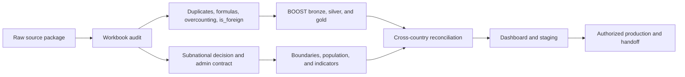

# MEGA Country Onboarding Skills

An evidence-gated Codex skill suite for taking a new country from raw fiscal data to validated MEGA tables and dashboard release.

The suite is designed for work that spans `mega-boost`, `mega-indicators`, and `rpf-country-dash`. It treats onboarding as one traceable delivery rather than a collection of repository edits.

## What it covers



The release gates cover:

- immutable source inventory, lineage, hashes, years, stages, units, and owners;
- Excel sheet, header, exact-row, and business-key duplicates;
- formula coverage, hardcoded overrides, safe formula rewrites, and workbook discrepancies;
- same-depth classification overlap and within-formula double counting;
- independently derived `is_foreign` flags and yearly amount conservation;
- central-only versus subnational scope and administrative granularity;
- boundary, population, indicator, aggregate, dashboard, staging, and production validation;
- an evidence-backed manifest that another developer can resume without relying on chat history.

## Skills

| Skill | Responsibility |
|---|---|
| `mega-country-onboarding` | Orchestrate the full workflow and release manifest |
| `mega-boost-onboarding` | Audit the workbook and build the country BOOST pipeline |
| `mega-boost-overcounting` | Detect overlaps and document classification ownership |
| `mega-subnational-onboarding` | Decide and validate geography, boundaries, population, and indicators |
| `mega-onboarding-validation` | Reconcile the connected system and collect release evidence |

## Internal quick start

Keep the three working repositories under one clean parent directory. Then create the first-hour onboarding record directly from the authoritative workbook:

```bash
python skills/mega-country-onboarding/scripts/start_country.py \
  --country "<country>" --iso2 <ISO2> --iso3 <ISO3> \
  --workbook "/approved/source/snapshot.xlsx" \
  --source-owner "<team or source owner>" \
  --year 2023 --year 2024 \
  --stage approved --stage executed \
  --currency "<currency>" --amount-unit "<unit>" \
  --fiscal-year-convention "<convention>" \
  --repo-root "/path/to/wb-mb" \
  --workspace "/path/to/wb-mb/onboarding/<iso3-lower>"
```

The command refuses to overwrite an existing onboarding record or start from a dirty repository. It hashes the workbook, records all three baseline SHAs, validates the source inventory, marks intake passed, and leaves one concrete next action in the manifest.

Resume with:

```bash
python skills/mega-country-onboarding/scripts/check_manifest.py next \
  --manifest "/path/to/onboarding/<iso3-lower>/onboarding-manifest.json"
```

To see the local workflow before touching country data, run the synthetic DemoLand preflight:

```bash
python skills/mega-country-onboarding/scripts/run_demoland.py \
  --output /tmp/mega-demoland
```

It exercises intake, workbook inventory, duplicate coverage, overcounting, independent foreign-funding logic, and the subnational decision. It deliberately stops before live BOOST ETL, Databricks, dashboard, staging, or production work.

## Install

Copy the skill directories into your Codex skills directory:

```bash
cp -R skills/* ~/.codex/skills/
```

For repository-local use, keep `skills/` in the workspace and point Codex to the orchestrator:

```text
Use $mega-country-onboarding to onboard <country> from <raw package path>.
```

Start with `skills/mega-country-onboarding/SKILL.md`. The orchestrator routes the specialist skills and creates a schema-v4 onboarding manifest.

## Local requirements

The deterministic checks use Python, pandas, openpyxl, and Shapely. Install the development environment with:

```bash
python -m venv .venv
source .venv/bin/activate
python -m pip install -r requirements-dev.txt
```

Run the repository checks:

```bash
ruff format --check skills scripts
ruff check skills scripts
python scripts/validate_repository.py
python -B skills/mega-country-onboarding/scripts/run_suite_regression_tests.py
```

## Safety boundaries

- Keep authoritative workbooks and raw country data outside Git.
- Store only safe metadata, configurations, and reports in an onboarding worktree.
- Treat unsupported checks and missing coverage as unresolved rather than passing or zero.
- Require explicit authority before rewriting a source workbook or running production.
- Do not store Databricks tokens, private URLs, or credentials in manifests and logs.

This repository contains workflow automation only. It does not include country source data, production credentials, or deployment authority.

## License

[MIT](LICENSE)
