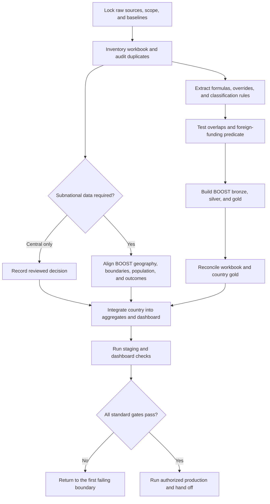

# End-to-end workflow

Follow this dependency order. A later mismatch can reopen an earlier phase; update the manifest instead of working around the original problem downstream.

## Phase outputs

| Phase | Owning skill | Exit artifact |
|---|---|---|
| Source intake | `mega-country-onboarding` | source inventory and `source_intake` report |
| Workbook and country ETL | `mega-boost-onboarding` | inventory, duplicate report, rule set, foreign report, country tables, reconciliation |
| Classification overlap | `mega-boost-overcounting` | overlap report and ownership ledger |
| Geography and indicators | `mega-subnational-onboarding` | central-only decision or admin contract and coverage report |
| Cross-stack release | `mega-onboarding-validation` | release report tied to refs, runs, and table snapshots |
| Handoff | `mega-country-onboarding` | release-ready manifest and remaining actions |

## Status meanings

- `passed`: current evidence meets the gate's acceptance criteria.
- `blocked`: a named source, permission, or decision prevents further work.
- `in_progress`: work or validation remains.
- `not_started`: no reliable evidence exists yet.
- `not_applicable`: reserve for optional, non-standard checks. Standard release gates still need a passing result.

A check that did not run has no result. Record it as pending or blocked rather than inferring a pass from the absence of failures.

## Decisions that need a person

Escalate only the choices that change business meaning or authority:

1. select the authoritative source when valid candidates conflict;
2. select the target geography when sources cannot align exactly;
3. assign ownership for a confirmed same-depth classification overlap;
4. authorize a source-workbook rewrite;
5. accept a documented approximation or material discrepancy;
6. approve the production run or publication.

Everything else should be discoverable from the current source, repositories, and platform state.
